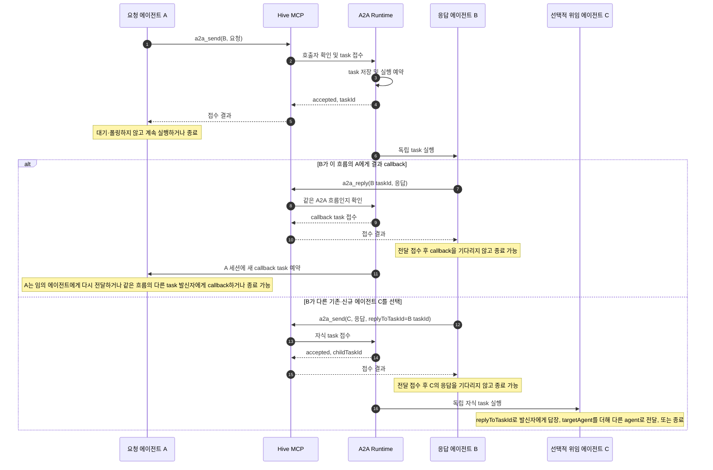
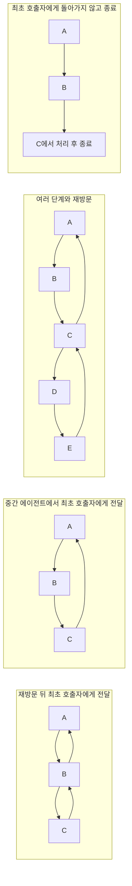
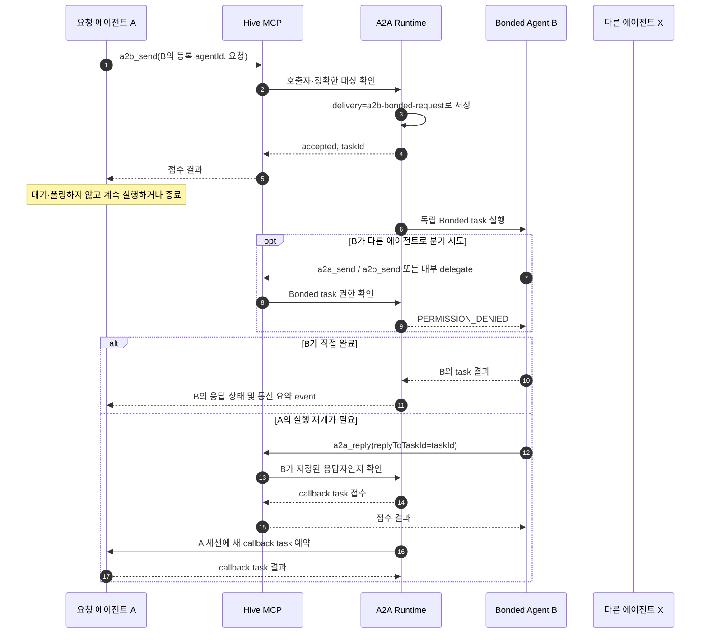

# A2A·A2B 흐름과 개발 방향

이 문서는 Hive 에이전트 간 비동기 요청의 두 경로를 정의한다. A2A에서는 `a2a_list`에서 선택한 에이전트에게 작업을 보내고, 응답자가 결과를 발신자에게 돌려보내거나 다른 목록 에이전트로 전달한다. 응답 경로는 처음 호출한 에이전트로 고정되지 않고 이미 방문한 에이전트를 다시 거칠 수도 있다. A2B는 한 에이전트를 해당 요청의 Bonded Agent로 지정하며, 그 에이전트가 직접 응답해야 한다.

두 흐름 모두 요청을 시작한 에이전트가 결과를 기다리지 않는다. 전송 도구는 작업을 저장하고 실행을 예약한 뒤 접수 정보만 반환한다. 요청자는 자신의 작업을 계속하거나 종료한다. 새 요청은 `a2a_send(targetAgent, message)`로 보낸다. 현재 task 발신자에게 답장할 때는 `a2a_reply(replyToTaskId, message)`를 쓴다. 다른 에이전트로 결과를 전달할 때는 `a2a_send(targetAgent, message, replyToTaskId)`를 쓴다. 접수는 전달 요청이 저장됐다는 뜻이며 완료를 기다리지 않는다. 큰 작업은 독립된 하위 작업으로 나누고, 각 결과를 task ID로 callback해 회수한다. task는 기본적으로 자동 timeout이 없으며, 양수 `timeoutMs`로 제한할 수 있다. 장시간 task는 HTTP API에서 취소를 요청할 수 있으며 실제 취소는 provider 지원에 따른다.

## A2A 흐름

A2A task를 받은 agent는 발신자에게 답할 때 현재 task ID를 `a2a_reply.replyToTaskId`에 넣는다. 다른 agent에게 결과를 전달할 때는 `a2a_send`에 `targetAgent`, `message`, 현재 task의 `replyToTaskId`를 전달한다. 고정된 두 도구 입력은 조건부 필드 선택 없이 검증된다. Hive는 이 입력을 내부 `responseForTaskId` 또는 `callbackForTaskId` 상관관계로 변환해 기존 room·흐름·중복 검사를 유지한다. 흐름 안에서 에이전트가 다시 등장할 수 있으며 전체 경로는 `maxDepth`로 제한한다. 접수 응답에는 요청 본문이 포함되지 않는다.

### 재방문 경로와 snapshot 검증

A2A의 task parent-child 경로와 callback을 포함한 전체 통신 흐름은 깊이를 따로 기록한다. `task.depth`와 `visitedAgents`는 parent-child 계보를, `a2aFlowId`와 `a2aFlowDepth`는 callback이 새 root task를 만들더라도 이어지는 A2A 통신 흐름을 나타낸다. `visitedAgents`는 순서가 있는 경로이며 중복 없는 집합이 아니다. A2A 재방문은 허용하고 `maxDepth`로 깊이를 제한한다.

snapshot 검증은 `visitedAgents` 중복 자체를 거부하지 않는다. Task aggregate도 경로의 순서·길이·마지막 대상과 legacy root 예외를 검증한다. 기존 snapshot shape와 외부 API는 유지했다. JSON shape와 레코드 간 참조 검증은 Infrastructure persistence에 있으며, Application mapper가 runtime projection과 Aggregate를 변환한다. Durable Aggregate Repository와 snapshot 기반 Aggregate 재구성은 [협업 도메인 DDD 계획](./collaboration-domain-plan.ko.md)의 후속 단계다.

다음 경로는 모두 A2A에서 허용한다. 각 단계에서 응답을 전달받은 에이전트가 다음 대상을 선택하며, callback은 특정 흐름 task의 발신자를 지정해 사용한다.

## A2B 흐름

Bonded Agent는 요청 task의 `targetAgent`와 같은 에이전트다. 완료 결과를 반환하는 경로와 콜백을 보내는 경로 모두 이 신원을 보존한다. 콜백은 분기가 아니라 원 요청자에게 보내는 응답 전달이며, 다른 응답자나 중간 에이전트가 Bonded 응답을 대신할 수 없다.

## 현재 계약

| 규칙 | A2A | A2B |
|---|---|---|
| 요청 도구 | `a2a_send` | `a2b_send` |
| 대상 | `a2a_list`의 `targetAgent` 값 | 같은 room에 등록된 정확한 `targetAgent` |
| 요청자 대기 | 없음. 접수 직후 계속 실행 | 없음. 접수 직후 계속 실행 |
| 응답 전달 | 발신자에게 `a2a_reply`; 다른 agent에게는 `a2a_send`와 `replyToTaskId` | 지정된 Bonded Agent만 응답하고, 직접 완료하거나 `a2a_reply` |
| 추가 위임 | 가능. 자식 task도 비동기 | 금지. MCP send와 `AgentExecutionContext.delegate` 양쪽에서 거부 |
| 다음 행동 | 결과를 받은 에이전트가 임의 경로로 전달 또는 종료 선택. 에이전트 재방문 허용, 전체 깊이 제한 적용 | Bonded Agent의 분기 금지. 본인 응답 또는 원 요청자 callback만 허용 |

MCP의 현재 도구 목록은 `a2a_list`, `a2a_send`, `a2a_reply`, `a2b_send`를 제공한다. `a2a_list`는 인자 없이 호출하며, 각 항목의 `targetAgent`는 Hive가 세션마다 발급한 호출용 UUID다. `sessionName`은 사용자가 지정한 세션명이고 `provider`는 프로바이더명이다. 역할·기능·상태도 함께 반환하며, 세션 이름과 UUID가 없는 항목은 호출 대상으로 노출하지 않는다. 새 요청은 목록의 `targetAgent`와 메시지를 `a2a_send`로 보낸다. 답장은 `a2a_reply`에 현재 task ID와 메시지를 전달한다. 결과를 다른 목록 에이전트로 보낼 때는 `a2a_send`에 대상과 현재 task ID를 함께 전달한다. Send와 Reply 스키마는 필수 필드가 고정되어 있으며 `anyOf`를 사용하지 않는다. 목록은 중복 `agentId`나 workspace 경로를 모델에 노출하지 않는다. MCP schema는 이름·selector 대상과 `responseForTaskId`·`callbackForTaskId`를 광고하지 않으며, 이전 호출 호환을 위해 transport 처리기는 유지한다. `a2a_list_agents`는 `a2a_list`로 통합했다. `a2a_wait_task`는 에이전트에 광고하지 않는다. 이전 클라이언트가 명시적으로 부르는 경우를 위해 기존 직접 처리기는 남아 있으므로, 이 호환 경로는 이후 제거 여부를 별도로 결정해야 한다. HTTP/SSE 소비자는 task 상태와 이벤트를 조회할 수 있다.

## 개발 방향

### 1. 요청과 응답의 상관관계를 계약으로 고정

- `a2a_send`와 `a2a_reply`의 필수 필드가 고정되어 있다. transport는 `replyToTaskId`를 내부 결과 전달 또는 callback 상관관계로 변환한다.
- A2A 요청 task는 답장 전달이 접수되기 전에 성공으로 끝날 수 없다. 결과 전달 task를 받은 agent는 추가 전달 없이 끝낼 수 있다.
- `a2b_send`의 대상 검증과 응답자 검증은 task 생성 시 한 번만 수행하지 말고, callback과 모든 하위 task 진입점에서도 적용한다.
- 같은 task ID에 대한 중복 callback, 다른 room이나 다른 A2A 흐름의 task ID를 경계에서 거부한다. 동일 흐름은 callback task가 새 root가 되어도 상관관계를 이어가며, 깊이 한도를 적용한다. 응답 본문은 지정된 수신자 외에 노출하지 않는다.

### 2. 비동기 실행을 기본 경로로 유지

- 요청 도구는 task를 영속화한 뒤 접수 ID를 반환한다. provider 완료 promise를 요청 tool 응답과 묶지 않는다.
- 부모 task를 자식 완료 대기 상태로 바꾸거나 workspace lock을 자식 완료까지 점유하지 않는다. 각 task가 실행 시 자신의 lock을 획득하고 끝날 때 반환한다.
- 부모 task의 취소·timeout과 이미 접수된 자식 task의 취소 정책을 명시한다. 부모의 정상 종료가 자식의 취소로 해석되지 않도록 하고, 부모 취소 시에는 현재 계약에 따라 연결된 자식을 정리한다.
- 기존 `a2a_wait_task` 직접 처리 경로는 호환성을 위해 숨겨 둔 상태다. 모든 소비자가 이벤트 또는 task 조회로 옮긴 뒤 blocking API와 `WAITING` 상태 전이를 제거할지 결정한다.

### 3. 콜백을 요청자의 새 실행으로 전달

- callback은 같은 A2A 흐름의 대상 task ID와 그 task 발신자를 검증해 해당 등록 에이전트 세션에 독립 root인 새 비동기 task로 예약한다. A2A 흐름 ID와 깊이는 새 root 사이에도 이어간다. callback 응답을 다음 사용자 입력까지 보류하지 않고, 대상 agent의 task queue가 기존 실행과 직렬화한다.
- 직접 task 완료 결과와 callback task를 서로 다른 task ID로 기록하고, UI·SSE 요약에서 요청과 응답의 짝을 유지한다.
- 세션이 offline이거나 provider가 task를 받을 수 없는 경우를 숨기지 말고 실패 상태로 남긴다. 자동 재시도는 callback 중복 방지와 함께 설계한다.

### 4. A2B 분기 금지를 모든 실행 경로에 적용

- 현재 MCP 요청 처리와 application delegate port에서 적용하는 차단을 유지한다. 새 tool, HTTP 진입점, 설정형 adapter를 추가할 때마다 같은 규칙을 통과시킨다.
- 허용되는 유일한 후속 메시지는 Bonded Agent 자신이 원 요청자를 대상으로 보내는 callback이다. 대상 변경, selector, callback 재위임은 실패 처리한다.
- 새 provider adapter가 Bonded 요청을 처리할 때 prompt 지시뿐 아니라 runtime 권한 검사도 갖춰야 한다. prompt만으로 분기 금지를 보장하지 않는다.

### 5. 지연과 토큰을 실제 경로에서 줄임

- task prompt에는 현재 요청, 필요한 task ID·agent ID, 해당 task의 A2A/A2B 규칙만 넣는다. 이전 대화나 전체 agent roster는 자동 첨부하지 않는다.
- agent 목록은 필요할 때만 조회하고, 접수 응답은 `taskId`와 상태만 반환한다. 하위 결과를 기다리는 반복 호출을 기본 흐름으로 만들지 않는다.
- Codex는 기존 Hive app-server 연결과 ephemeral task thread를 사용한다. 요청별 영구 세션 생성이나 provider별 불필요한 thread 복구 왕복을 추가하지 않는다.
- 최적화 전후에 task 대기열 지연, provider 실행 시간, callback 전달 시간, 가능한 경우 provider token 사용량을 구분해 측정한다. prompt나 파일 내용을 진단 로그에 남기지 않는다.

### 6. 런타임 검증 순서

1. 가짜 adapter로 A2A 접수 후 요청자가 먼저 종료해도 자식 task가 완료되는지 확인한다.
2. 새 요청의 `targetAgent` 전달, `replyToTaskId`로 발신자에게 답장, `targetAgent`를 더한 결과 forward, 결과 수신 agent의 다음 답장 또는 종료, 새 callback root를 가로지르는 같은 흐름 상관관계, 에이전트 재방문, cross-room/cross-flow task 거부, task별 중복 답장, callback 사이의 `maxDepth` 적용을 확인한다.
3. A2B가 정확한 등록 agent만 받는지, Bonded Agent의 MCP·내부 delegate 분기와 타 에이전트 callback을 거부하는지 확인한다.
4. 같은 workspace의 부모 종료 후 자식 lock 획득, task timeout·취소, callback 대상 offline을 확인한다.
5. Codex, OpenCode, Kiro를 각각 점검한다. 빌드는 타입·패키징 호환성만 확인하며 실제 응답 전달 검증을 대신하지 않는다.
