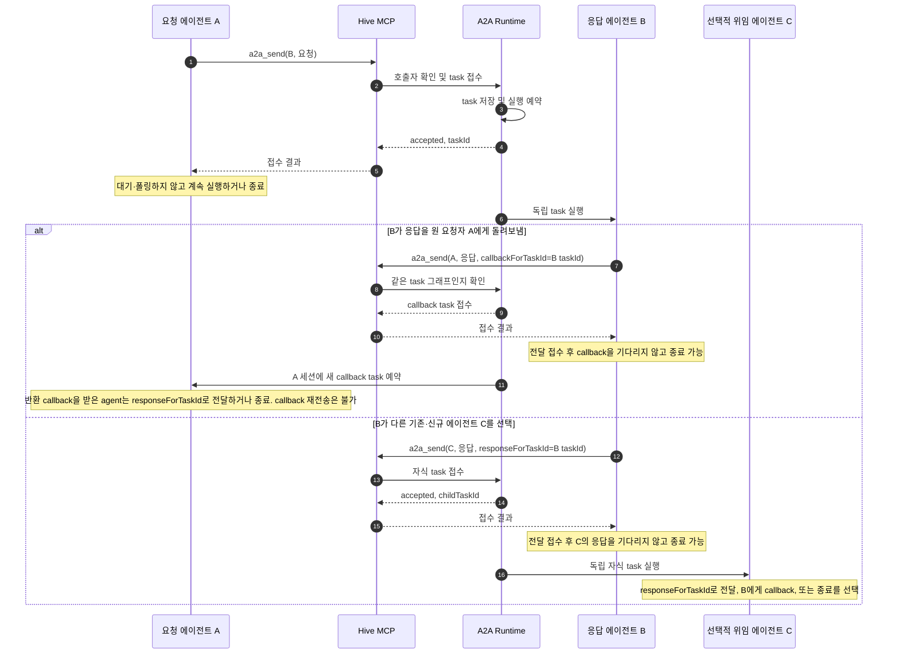

# A2A·A2B 흐름과 개발 방향

이 문서는 Hive 에이전트 간 비동기 요청의 두 경로를 정의한다. A2A에서는 응답자가 응답을 선택한 기존·신규 에이전트에게 전달해야 하며, 전달받은 에이전트가 이를 다시 보낼지 마칠지 결정한다. 같은 task 그래프의 에이전트는 원 요청자에게 결과 callback을 보낼 수도 있다. A2B는 한 에이전트를 해당 요청의 Bonded Agent로 지정하며, 그 에이전트가 직접 응답해야 한다.

두 흐름 모두 요청을 시작한 에이전트가 결과를 기다리지 않는다. 전송 도구는 작업을 저장하고 실행을 예약한 뒤 접수 정보만 반환한다. 요청자는 자신의 작업을 계속하거나 종료한다. A2A는 응답이 `a2a_send`로 직접 요청자 또는 응답자가 고른 기존·신규 에이전트에게 전달 접수되면 성공이다. 다른 agent에게 결과를 보내는 경우 `responseForTaskId`에 현재 A2A task ID를 넣어 단순 작업 요청과 결과 전달을 구분한다. 원 요청자에게 결과를 돌려보낼 때는 `callbackForTaskId`를 쓴다. 응답 task를 완료하거나 결과를 기록하는 것만으로 전달을 대신하지 않는다. Hive는 응답을 task 그래프의 상위 호출자까지 자동으로 되돌리지 않는다. 응답을 받은 에이전트가 그 결과를 다시 전달할지, 작업을 마칠지 결정한다.

## A2A 흐름

A2A 응답은 `a2a_send`의 메시지로 선택한 기존 agentId 또는 새 `targetSessionName`에 전달해야 한다. 다른 agent에게 보내는 결과 task에는 `delivery=a2a-result-delivery`와 `responseForTaskId`가 기록되며, 수신 에이전트는 결과를 다시 전달하거나 발신 agent에게 한 번 callback을 보내거나 끝낼 수 있다. callback을 받은 agent는 결과를 다른 agent에게 전달하거나 끝낼 수 있지만 callback을 다시 보낼 수 없다. `a2a_send`가 전달을 접수하면 응답 전달은 성공한 것이며 발신 task는 수신 task의 완료를 기다릴 필요가 없다. 원 요청자에게 돌려보내려면 응답자가 `callbackForTaskId`로 별도 task를 보낸다. callback은 독립 root로 예약되어 요청자의 등록 adapter/session에서 실행된다. Hive는 결과를 task 그래프의 상위 호출자까지 자동 전파하지 않는다. 응답 요청 task를 받은 agent가 전달 없이 끝내면 task는 성공하지 않는다. 접수 응답에는 요청 본문이 포함되지 않는다.

## A2B 흐름

Bonded Agent는 요청 task의 `targetAgent`와 같은 에이전트다. 완료 결과를 반환하는 경로와 콜백을 보내는 경로 모두 이 신원을 보존한다. 콜백은 분기가 아니라 원 요청자에게 보내는 응답 전달이며, 다른 응답자나 중간 에이전트가 Bonded 응답을 대신할 수 없다.

## 현재 계약

| 규칙 | A2A | A2B |
|---|---|---|
| 요청 도구 | `a2a_send` | `a2b_send` |
| 대상 | ID, 세션 이름 또는 selector로 선택 | 같은 room에 등록된 정확한 `agentId` |
| 요청자 대기 | 없음. 접수 직후 계속 실행 | 없음. 접수 직후 계속 실행 |
| 응답 전달 | 지정 대상은 `responseForTaskId`로 기존·신규 에이전트에게 응답을 전달하거나, 원 요청자에게 callback | 지정된 Bonded Agent만 응답하고, 직접 완료하거나 원 요청자에게 callback |
| 추가 위임 | 가능. 자식 task도 비동기 | 금지. MCP send와 `AgentExecutionContext.delegate` 양쪽에서 거부 |
| 다음 행동 | 결과를 받은 에이전트가 전달 또는 종료를 선택. 같은 task 그래프의 callback 가능 | Bonded Agent의 분기 금지. 본인 응답 또는 원 요청자 callback만 허용 |

MCP의 현재 도구 목록은 `a2a_list_agents`, `a2a_send`, `a2b_send`를 제공한다. `a2a_wait_task`는 에이전트에 광고하지 않는다. 이전 클라이언트가 명시적으로 부르는 경우를 위해 기존 직접 처리기는 남아 있으므로, 이 호환 경로는 이후 제거 여부를 별도로 결정해야 한다. HTTP/SSE 소비자는 task 상태와 이벤트를 조회할 수 있다.

## 개발 방향

### 1. 요청과 응답의 상관관계를 계약으로 고정

- `responseForTaskId`는 결과 전달과 새 작업 요청을 구분하고, `callbackForTaskId`는 발신자 회신을 나타낸다. 임의 문자열 metadata에 의존하는 나머지 delivery 구분도 명시적 타입으로 옮긴다.
- A2A 요청 task는 `responseForTaskId` 결과 전달 또는 callback 접수 전에는 성공으로 끝날 수 없다. 결과 전달 task를 받은 agent는 추가 전달 없이 끝낼 수 있다.
- `a2b_send`의 대상 검증과 응답자 검증은 task 생성 시 한 번만 수행하지 말고, callback과 모든 하위 task 진입점에서도 적용한다.
- 콜백 중복, 반환 callback의 재전송, 다른 room의 task ID, 완료되지 않은 task를 가장한 callback을 경계에서 거부한다. 응답 본문은 승인된 caller 외에 노출하지 않는다.

### 2. 비동기 실행을 기본 경로로 유지

- 요청 도구는 task를 영속화한 뒤 접수 ID를 반환한다. provider 완료 promise를 요청 tool 응답과 묶지 않는다.
- 부모 task를 자식 완료 대기 상태로 바꾸거나 workspace lock을 자식 완료까지 점유하지 않는다. 각 task가 실행 시 자신의 lock을 획득하고 끝날 때 반환한다.
- 부모 task의 취소·timeout과 이미 접수된 자식 task의 취소 정책을 명시한다. 부모의 정상 종료가 자식의 취소로 해석되지 않도록 하고, 부모 취소 시에는 현재 계약에 따라 연결된 자식을 정리한다.
- 기존 `a2a_wait_task` 직접 처리 경로는 호환성을 위해 숨겨 둔 상태다. 모든 소비자가 이벤트 또는 task 조회로 옮긴 뒤 blocking API와 `WAITING` 상태 전이를 제거할지 결정한다.

### 3. 콜백을 요청자의 새 실행으로 전달

- 콜백은 원 요청 task ID와 응답자 권한을 검증하고 원 요청자의 기존 에이전트 세션에 독립 root인 새 비동기 task로 예약한다. callback 응답을 다음 사용자 입력까지 보류하지 않고, 대상 agent의 task queue가 기존 실행과 직렬화한다.
- 직접 task 완료 결과와 callback task를 서로 다른 task ID로 기록하고, UI·SSE 요약에서 요청과 응답의 짝을 유지한다.
- 세션이 offline이거나 provider가 task를 받을 수 없는 경우를 숨기지 말고 실패 상태로 남긴다. 자동 재시도는 callback 중복 방지와 함께 설계한다.

### 4. A2B 분기 금지를 모든 실행 경로에 적용

- 현재 MCP 요청 처리와 application delegate port에서 적용하는 차단을 유지한다. 새 tool, HTTP 진입점, 설정형 adapter를 추가할 때마다 같은 규칙을 통과시킨다.
- 허용되는 유일한 후속 메시지는 Bonded Agent 자신이 원 요청자를 대상으로 보내는 callback이다. 대상 변경, selector, callback 재위임은 실패 처리한다.
- 새 provider adapter가 Bonded 요청을 처리할 때 prompt 지시뿐 아니라 runtime 권한 검사도 갖춰야 한다. prompt만으로 분기 금지를 보장하지 않는다.

### 5. 지연과 토큰을 실제 경로에서 줄임

- task prompt에는 현재 요청, 필요한 task ID·agent ID, 해당 task의 A2A/A2B 규칙만 넣는다. 이전 대화나 전체 agent roster는 자동 첨부하지 않는다.
- agent 목록은 필요할 때만 조회하고, 접수 응답은 `taskId`와 상태만 반환한다. 하위 결과를 기다리는 반복 호출을 기본 흐름으로 만들지 않는다.
- Codex는 기존 Hive app-server 연결과 ephemeral task thread를 사용한다. 요청별 영구 세션 생성이나 provider별 불필요한 thread 복구 왕복을 추가하지 않는다.
- 최적화 전후에 task 대기열 지연, provider 실행 시간, callback 전달 시간, 가능한 경우 provider token 사용량을 구분해 측정한다. prompt나 파일 내용을 진단 로그에 남기지 않는다.

### 6. 런타임 검증 순서

1. 가짜 adapter로 A2A 접수 후 요청자가 먼저 종료해도 자식 task가 완료되는지 확인한다.
2. `responseForTaskId` 없는 A2A 응답 실패, 기존/신규 agent 결과 전달, 결과 수신 agent의 forward/callback/finish, 같은 root callback, cross-room/stale task 거부, 중복 callback을 확인한다.
3. A2B가 정확한 등록 agent만 받는지, Bonded Agent의 MCP·내부 delegate 분기와 타 에이전트 callback을 거부하는지 확인한다.
4. 같은 workspace의 부모 종료 후 자식 lock 획득, task timeout·취소, callback 대상 offline을 확인한다.
5. Codex, OpenCode, Kiro를 각각 점검한다. 빌드는 타입·패키징 호환성만 확인하며 실제 응답 전달 검증을 대신하지 않는다.
