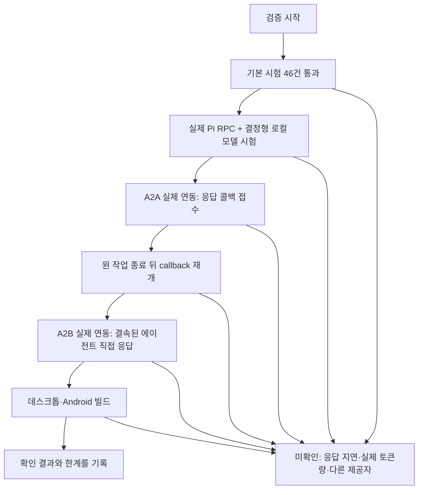
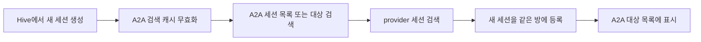
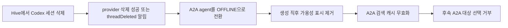
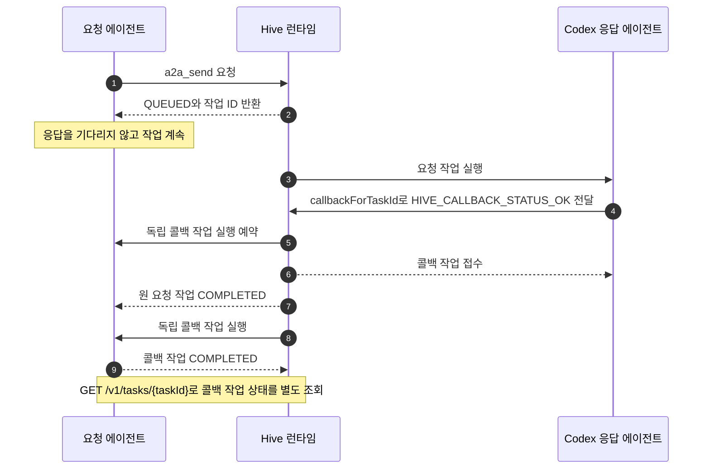
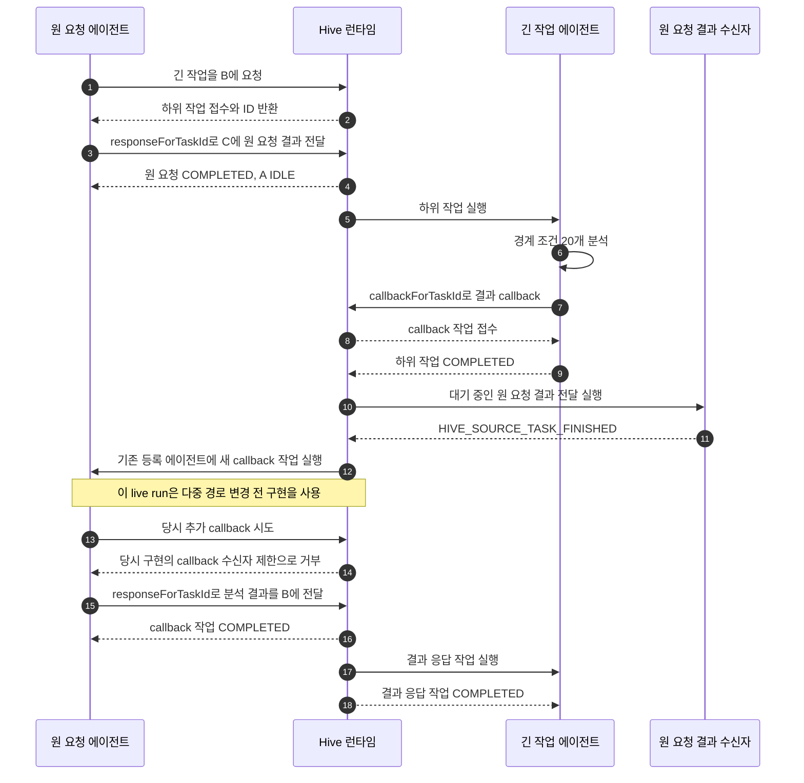
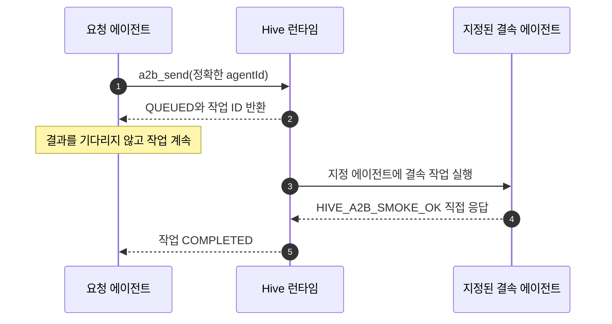
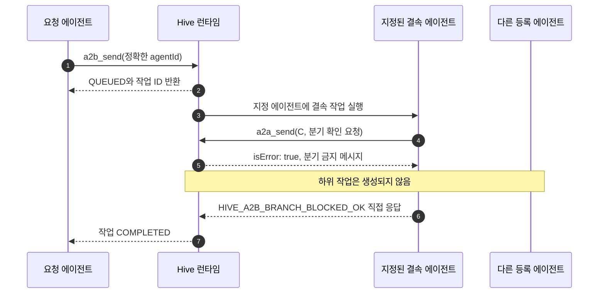
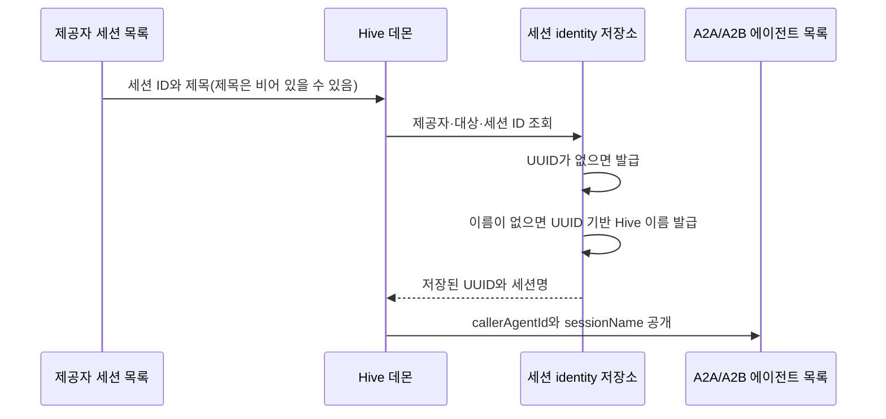

# A2A·A2B 검증 기록

이 문서는 비동기 에이전트 요청의 자동 시험, 실제 Codex 연동, 실제 Pi RPC와 Hive 도구 왕복, 빌드 결과와 미확인 범위를 기록한다. 현재 계약과 개발 순서는 [A2A·A2B 흐름과 개발 방향](./a2a-a2b-flows.ko.md), 런타임 구조는 [A2A 런타임](./a2a-runtime.ko.md)을 참조한다.

## 검증 요약

| 구분 | 수행한 검증 | 결과 |
|---|---|---|
| 기본 자동 시험 | `node --test --test-timeout=15000 tests/*.test.mjs` | 46건 통과, 실시간 Pi 시험 1건은 명시적 실행 전용으로 건너뜀 |
| Pi 실제 RPC 시험 | `HIVE_RUN_PI_LIVE_A2A=1 node --test --test-timeout=120000 tests/pi-a2a-live.test.mjs` | Pi CLI/RPC가 A2A callback과 A2B 도구를 실행. A2B 분기 시도는 거부되고 하위 작업은 생성되지 않음 |
| A2A 실제 연동 | 원 요청자 콜백을 접수하고 콜백 작업 ID를 별도 조회 | 원 요청 및 콜백 작업 모두 `COMPLETED`, 연결된 원 요청 ID 일치 |
| A2A 원 작업 종료 후 재개 | 원 작업을 먼저 종료한 뒤 긴 하위 작업 결과 callback을 같은 에이전트로 전달하고 후속 응답 상태 조회 | 원 작업 종료 후 callback 작업이 같은 대상 에이전트에서 `COMPLETED`; 결과 응답 전달도 `COMPLETED` |
| A2A 다중 경로 모의 runtime | `A-B-C-A`, `A-B-C-B-A`, `A-B-C-D-E-C-A`, callback root 사이 흐름 연결, 깊이 한도 확인 | 호출자에게 돌아가는 고정 경로가 없으며 재방문·다중 callback 허용, task별 중복 callback과 흐름 깊이 한도 유지 |
| Pi MCP 도구 회귀 시험 | 생성된 Pi 확장 도구를 인증 HTTP/MCP runtime에 연결하고 세 경로를 실행 | A2A 전달·재방문, A2B 결속·분기 거부, Pi 대화 요약 수신 확인 |
| A2B 실제 연동 | 정확한 `agentId`를 지정해 결속된 에이전트의 직접 응답 확인 | 요청 접수 후 직접 응답, 작업 상태 `COMPLETED` |
| A2B 분기 거부 | 결속 작업 안에서 다른 등록 에이전트로 `a2a_send` 시도 | 거부 응답, 하위 작업 미생성, 결속 작업 `COMPLETED` |
| 빌드 | 루트, 공유 앱, 데스크톱, Android 빌드 | 2026-10-01 검증에서 모두 통과 |
| 형식 검사 | `git diff --check` | 통과 |

## 새 세션 검색 갱신

2026-10-02 점검에서 A2A가 시작된 뒤 Hive에서 만든 세션이 바로 에이전트 목록에 나타나지 않는 원인을 확인했다. 런타임은 세션 검색 결과를 방 단위로 15초 동안 캐시했지만, Hive의 일반 세션 생성 경로가 이 캐시를 무효화하지 않았다. 따라서 캐시 만료 전 `a2a_list`나 대상 검색을 요청하면 새 세션이 누락될 수 있었다.

Hive가 세션 생성을 마치면 A2A 검색 캐시를 무효화하도록 연결했다. 검색이 진행 중인 때 무효화가 발생해도 그 검색 결과가 새 캐시로 저장되지 않으며, 대기 중인 다음 조회는 검색을 다시 실행한다. Hive에서 새 세션을 만든 직후 같은 방의 A2A 목록에 등록되는 회귀 검사를 추가했다.

| 검증 | 결과 |
|---|---|
| `npm run build` | 통과 |
| `node --test --test-timeout=15000 tests/a2a-async.test.mjs` | 19건 통과 |
| `node --test --test-timeout=15000 tests/a2a-performance.test.mjs` | 21건 통과 |
| `git diff --check` | 통과 |

Hive 바깥의 provider 앱이나 CLI가 만든 세션은 Hive 세션 생성 알림을 거치지 않는다. 이 경우 기존 15초 만료 주기에 따라 다음 검색에서 발견된다.

2026-10-02에는 Hive에서 삭제한 Codex 세션이 A2A room에 `IDLE`로 남아 새 작업 대상이 될 수 있는 문제도 수정했다. Hive의 세션 삭제 성공과 Codex `threadDeleted` 알림을 A2A 런타임에 연결해 등록된 해당 세션을 `OFFLINE`으로 바꾸고 검색 캐시를 무효화한다. 삭제된 agent 기록은 기존 task 참조를 보존하기 위해 저장소에 남지만, 이후 A2A 작업 대상으로 선택되지 않는다. Hive 세션 어댑터의 생성 직후 가용성 예외도 삭제 시 지워서, 가용성 갱신이 삭제 세션을 다시 활성화하지 않게 했다.

삭제 후 A2A agent 목록에는 `OFFLINE` 상태가 남아 task 이력을 식별할 수 있지만, 대상 선택에는 사용할 수 없다.

### Pi 실제 제공자 시험

2026-10-01에 실제 설치된 Pi CLI/RPC를 사용해 A2A/A2B 왕복을 실행했다. Pi 세션, Pi RPC 요청·응답 처리, Hive가 생성한 Pi 확장, 인증 HTTP/MCP 호출, A2A runtime과 `HiveSessionAgentAdapter`는 실제 구현을 사용했다. `PiSessionManager`만 있는 격리 runtime을 만들어 Codex 등 다른 provider를 등록하지 않았다. Pi의 기본 파일·셸 도구를 끄고, 임시 Pi 설정과 loopback OpenAI 호환 fixture 모델을 사용해 인증된 tool call을 결정적으로 재현했다. 사용자 모델 설정이나 외부 모델 요청은 이 시험에서 사용하지 않았다.

실제 Pi가 `a2a_send`를 호출해 작업을 접수했고, 별도 Pi 작업 세션이 원 요청 task ID로 callback을 전송했다. callback 작업 결과에는 `HIVE_PI_A2A_OK`가 포함됐다. A2B에서는 실제 Pi가 `a2b_send`를 호출했고, 결속 세션의 `a2a_send` 분기 시도는 runtime이 거부했다. 거부된 대상 task는 생성되지 않았으며 Bonded Agent가 직접 `HIVE_PI_A2B_OK`를 반환해 완료했다. 해당 실시간 시험은 기본 테스트 묶음에서 자동으로 실행하지 않으며, `HIVE_RUN_PI_LIVE_A2A=1`로 켜서 별도로 실행한다.

설정된 모델을 이용한 초기 실시간 시도는 Pi prompt를 약 3분 처리했지만 Hive 도구 호출을 만들지 못했다. 이는 Pi RPC의 도구 연결 시험 결과로 간주하지 않는다. 설정 모델 자체의 tool-call 동작과 응답 속도는 별도 미검증이다.

## A2A 실제 연동 흐름

2026-10-01에 `127.0.0.1:4760`에서 실행 중이던 데몬을 통해 요청했다. `a2a_send`는 제공자 실행이 끝나기 전에 `QUEUED`와 작업 ID를 반환했다. Codex 응답자는 `callbackForTaskId`로 `HIVE_CALLBACK_STATUS_OK`를 원 요청자에게 전달했고, 원 요청 작업은 `COMPLETED`에 도달했다. 응답 결과에 포함된 콜백 작업 ID를 사용해 `GET /v1/tasks/{taskId}`로 별도 조회한 결과, 콜백 작업도 `COMPLETED`였고 `delivery`는 `a2a-result-callback`, `callbackForTaskId`는 원 요청 ID와 일치했다.

실행 요청에는 파일 읽기와 파일 수정을 하지 말라고 명시했다. 원 요청과 콜백 작업 모두 인증된 로컬 HTTP API로 상태를 확인했다.

### 원 작업 종료 뒤 긴 작업 결과 callback 재개

같은 날 실제 데몬에서 세 에이전트를 사용해 원 요청 A, 긴 작업자 B, 원 요청 결과 수신자 C의 흐름을 확인했다. A는 B에게 텍스트 기반 A2A 경계 조건 20개 분석을 요청하고, 접수 직후 원 요청 결과를 C에게 전달한 뒤 종료했다. 원 요청 `task-0b130f76-c00f-4d45-a8b3-fdb8b129de8c`가 `COMPLETED`되고 A가 `IDLE`이 된 뒤에 B의 긴 작업이 실행됐다. C에 대한 원 요청 결과 전달 작업 `task-9013b510-fb6c-4bf9-9647-28934612103a`도 `COMPLETED`됐다.

B는 하위 작업 `task-3a21e01e-93fa-4ead-9320-0d8d121b76b2`의 결과를 `callbackForTaskId`로 A에게 한 번 전달했다. callback 작업 `task-55bea252-c946-4365-b95a-d492b432e05a`는 원 작업 종료 뒤 생성됐고, 별도 `GET /v1/tasks/{taskId}` 조회에서 `delivery`가 `a2a-result-callback`, `callbackForTaskId`가 B의 하위 작업 ID, 대상이 A의 기존 `agentId`이며 상태가 `COMPLETED`임을 확인했다. 실행 중에도 해당 A 에이전트가 callback 작업 ID를 현재 작업으로 잡고 `WORKING`으로 바뀌었다.

callback을 받은 A는 같은 분석 결과를 B에게 반환하는 후속 응답 작업 `task-0da9b055-d2b9-4bca-bd06-d965cc50a5cd`를 만들었다. 전달 메타데이터의 `responseForTaskId`는 callback 작업 ID를 가리켰고, 결과에는 요청된 20개 항목 분석이 포함됐다. 이 응답 전달 작업도 `COMPLETED`됐으며, A·B·C 모두 최종적으로 `IDLE`이 됐다. 이 당시 callback 수신자인 A의 추가 callback 시도는 이전 구현의 제한에 의해 거부됐고, A는 `responseForTaskId` 경로로 결과를 전달했다.

이후 A2A 경로를 임의로 이어갈 수 있다는 계약에 맞춰 callback 수신자 제한과 방문 에이전트 재방문 차단을 제거했다. 모의 runtime에서 `A-B-C-B-A`, `A-B-C-D-E-C-A` 흐름과 callback root 사이의 flow ID·깊이 연결을 확인했다. 실행 중이던 기존 데몬은 재시작하지 않았으므로 이 변경의 실 데몬 연동은 아직 다시 확인하지 않았다.

이 시험은 원 요청 task가 끝난 뒤에도 callback이 같은 등록 에이전트로 새 작업을 시작하고, 그 에이전트가 결과를 후속 응답으로 전달할 수 있음을 확인한다. 이는 종료된 제공자 turn이나 이전 대화 transcript를 다시 여는 동작이 아니라, 같은 등록 세션을 대상으로 callback payload를 담은 독립 A2A 작업을 실행하는 동작이다.

## A2B 실제 연동 흐름

같은 날 정확한 `agentId`를 지정해 `a2b_send`를 호출했다. 도구는 `QUEUED`와 작업 ID를 먼저 반환했고, 결속된 에이전트가 `HIVE_A2B_SMOKE_OK`를 직접 반환해 작업이 `COMPLETED`됐다.

실행 요청에는 파일 읽기와 파일 수정을 하지 말라고 명시했다.

### A2B 분기 거부 시험

별도의 A2B 요청 안에서 지정 에이전트가 다른 등록 에이전트로 `a2a_send`를 한 번 호출하도록 했다. 파일 읽기와 수정을 금지했다. MCP 응답은 `isError: true`였고, 결속 에이전트가 자기 A2B 작업의 결과 콜백만 보낼 수 있다는 거부 메시지를 반환했다. A2B 작업 그래프에는 하위 작업이 없었으며, 지정 에이전트는 `HIVE_A2B_BRANCH_BLOCKED_OK`를 직접 반환해 작업을 완료했다. 도구 응답에 별도 오류 코드는 없어서 거부 메시지와 작업 그래프를 함께 확인했다.

모의 어댑터 시험에서도 MCP 도구와 내부 위임 경로의 분기 거부를 각각 확인했다.

## 자동 시험 범위

기본 시험 43개와 별도 Pi RPC 시험은 다음 동작을 확인한다.

- A2A와 A2B 요청자가 접수 직후 반환되고, 제공자 작업이 별도로 계속 실행된다.
- A2A 응답을 기존·신규 에이전트에게 전달하고, `A-B-C-A`, `A-B-C-B-A`, `A-B-C-D-E-C-A`처럼 재방문하는 경로를 허용한다. 수신자가 재전달·콜백·종료 중 다음 행동을 선택한다.
- 응답 전달 없이 끝난 A2A 요청은 실패하며, callback은 같은 흐름의 task ID·방·대상 발신자를 확인한다. 같은 task ID의 중복 callback은 거부하지만 서로 다른 흐름 task로 callback을 이어갈 수 있다.
- callback은 참조된 task 발신자의 새 작업으로 예약되고, 새 root 사이에도 A2A flow ID와 깊이를 유지한다. 에이전트 재방문은 허용하며 깊이 한도·작업 공간 잠금·취소·제한 시간 규칙을 지킨다.
- A2B는 정확한 대상에 결합하고, MCP와 내부 위임 양쪽에서 다른 에이전트로 분기할 수 없다. 지정된 에이전트의 원 요청자 콜백은 허용한다.
- 작업 지시문에는 이전 대화와 전체 방 명단을 넣지 않는다. 실행 문맥에는 요청자와 대상만 전달한다.
- Codex 세션 메타데이터 확인은 활성 기록 세션을 재개하지 않으며, 접수 응답은 요청 본문과 작업 전체를 되돌려주지 않는다.
- Codex, OpenCode, Kiro, 설정형 CLI의 A2A 도구 주입과 응답 전달 계약을 모의 경로로 점검한다. Pi는 별도 시험에서 실제 RPC 프로세스와 생성 확장 도구를 로컬 결정형 model fixture에 연결해 검증한다.

토큰 절감 검증은 실제 제공자 사용량이 아니라 직렬화된 데이터와 작업 지시문의 크기를 이용한 회귀 기준이다. 시험 데이터에 이전 대화 100개와 에이전트 100개를 넣어도 작업 지시문은 UTF-8 기준 1,000바이트 미만이었고, 약 2.6KB 요청의 접수 응답은 256바이트 미만이었다.

## 세션 UUID와 이름 저장 확인

2026-10-02 시험에서 세션 identity 저장소가 provider 제목 없이도 UUID와 이름을 함께 만들고, 데몬 재생성 뒤에도 두 값을 유지하는지 확인했다. provider 제목을 전달하면 이름만 갱신되고 UUID는 유지된다. 이전 버전의 UUID-only 파일도 기존 UUID를 보존하며 버전 2로 바뀐다. A2A 등록 요약에는 데몬 저장소의 UUID와 대체 이름이 함께 나온다.

실행한 회귀 시험은 `node --test --test-timeout=15000 tests/session-identity-store.test.mjs tests/a2a-async.test.mjs tests/a2a-performance.test.mjs`이며, 45건이 통과했다.

## 빌드 기록

2026-10-02 identity 변경 확인에서 `npm run build`, `npm run desktop:build`, `npm run android:build`를 실행했다. 세 명령 모두 완료됐다. Desktop 번들에 500 kB 초과 묶음 경고가 있었고 Android Gradle에서 `flatDir`, SDK XML 버전 및 Java 네이티브 접근 경고가 나왔다. APK는 `artifacts/android/Hive-android-debug.apk`에 생성됐다.

2026-10-01 A2A/A2B 변경 검증에서 다음 명령을 실행했다.

- `npm run build`
- `npm run build:app`
- `npm run desktop:build`
- `JAVA_HOME=/usr/lib/jvm/java-21-openjdk-amd64 npm run android:build`
- `node --test --test-timeout=15000 tests/*.test.mjs` (43건 통과, Pi 실시간 시험 1건 기본 건너뜀)
- `HIVE_RUN_PI_LIVE_A2A=1 node --test --test-timeout=120000 tests/pi-a2a-live.test.mjs` (실제 Pi RPC 1건 통과)
- `git diff --check`

Android 빌드도 공유 앱 빌드를 실행한다. 데스크톱과 Android의 Vite 빌드에서 500 kB를 넘는 묶음 경고가 있었고, Android Gradle은 `flatDir` 및 SDK XML 버전 차이를 알렸다. 일부 Android Java 소스의 deprecated/unchecked API 알림도 있었지만 각 빌드는 완료됐다. 이 빌드 결과는 화면 조작이나 실기기 동작 확인을 뜻하지 않는다.

## 미확인 범위

- 실시간 지연 비교와 제공자가 보고한 실제 토큰 사용량은 측정하지 않았다. Pi 실제 RPC 시험은 외부 LLM 대신 결정형 loopback model fixture를 사용했다.
- 실제 A2B 분기 호출은 거부됐고 하위 작업은 생성되지 않았다. 도구 응답은 별도 오류 코드를 제공하지 않아 거부 메시지와 작업 그래프를 함께 확인했다.
- 설정된 실제 Pi 모델의 A2A tool-call 성공률·응답성과 실제 OpenCode·Kiro 요청/응답, 제공자 취소, 데스크톱 화면 조작과 Android 실기기 동작은 확인하지 않았다.
- 두 실제 연동은 Codex 대상으로 수행했다. 응답 지연이나 토큰 절감률의 대표값으로 간주하지 않는다.
